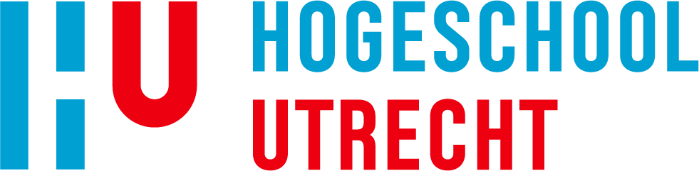

# Betrokken partijen

De **Beter Benutten Scan** is ontwikkeld door een combinatie van overheden,
kennisinstellingen en marktpartijen. Ieder brengt eigen kennis,
ervaring of data in om de scan steeds beter bruikbaar te maken voor gemeenten.

<article class="consortium-tegel">
  

    
  

  

    
Rijksoverheid

    <h2>Ministerie van Binnenlandse Zaken en Koninkrijksrelaties (BZK)</h2>
    
Leidt het programma Beter Benutten en is verantwoordelijk voor de ontwikkeling van de GBB-scan.

    
<a href="https://www.volkshuisvestingnederland.nl/onderwerpen/aanpak-woningnood/beter-benutten-van-bestaande-bebouwing">Lees meer over het programma Beter Benutten</a>

  

</article>

<article class="consortium-tegel">
  

    
  

  

    
Kennisinstelling

    <h2>Lectoraat Nieuwe Energie in de Stad (NEIDS)</h2>
    
Het lectoraat van Hogeschool Utrecht ontwikkelt en deelt kennis over de energietransitie in de gebouwde omgeving en circulair bouwen, beheren, onderhouden en renoveren.

    
<a href="https://www.hu.nl/onderzoek/nieuwe-energie-in-de-stad">Bekijk de website van NEIDS</a>

  

</article>

<article class="consortium-tegel">
  

    
  

  

    
Coöperatie

    <h2>Coöperatie Circol</h2>
    
Circol is een samenwerking van partijen die zich inzetten voor een circulaire economie en duurzaamheid in de stad. PIM.info is aangesloten bij de coöperatie en levert het platform voor de GBB-scan.

    
<a href="https://circol.nl/">Bekijk de website van Circol</a>

  

</article>

<article class="consortium-tegel">
  

    
  

  

    
Onderzoek en innovatie

    <h2>TNO</h2>
    
Is betrokken bij de ontwikkeling van het transformatieonderdeel van de GBB-scan en levert expertise op het gebied van data-analyse en scenario-ontwikkeling.

    
<a href="https://www.tno.nl/">Bekijk de website van TNO</a>

  

</article>

<article class="consortium-tegel">
  

    Koplopers
  

  

    
Gemeenten

    <h2>Koplopergemeenten</h2>
    
Om het beter benutten van bestaande gebouwen op grotere schaal mogelijk te maken, is een volgende stap nodig: gebiedsgericht werken. Daarom is het koplopersprogramma Beter Benutten gestart. Tien koplopergemeenten werken hierin samen aan een gebiedsgerichte aanpak, onder begeleiding van een kwartiermaker. De focus ligt niet langer op losse projecten, maar op samenhangend beleid voor een heel gebied. Zo wordt duidelijk welke strategieën, werkwijzen en instrumenten nodig zijn om beter benutten structureel toe te passen. De ervaringen uit het koplopersprogramma worden gebruikt om andere gemeenten te ondersteunen en het beter benutten van bestaande gebouwen landelijk op te schalen.

    
Koplopers: Rotterdam · Den Haag · Utrecht · Eindhoven · Arnhem · Zwolle · Leeuwarden · Ede · Rheden

  

</article>

